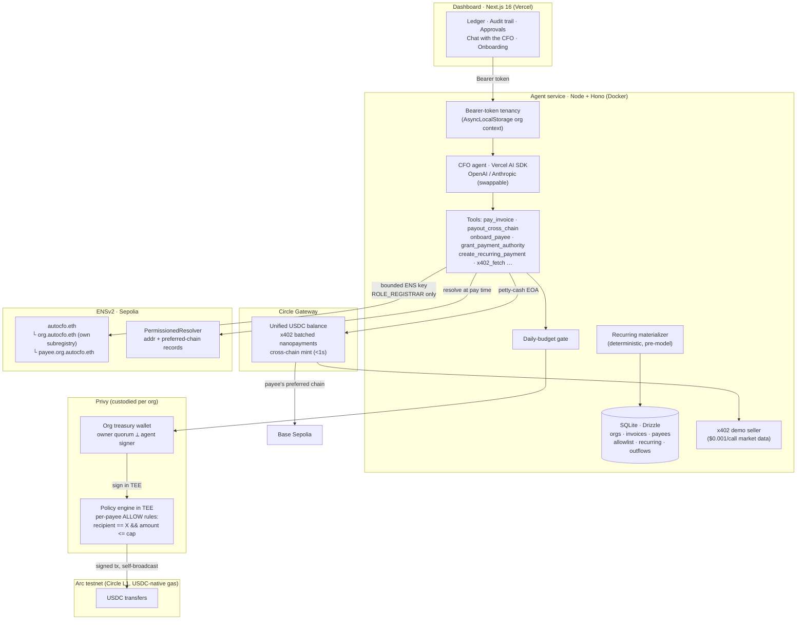
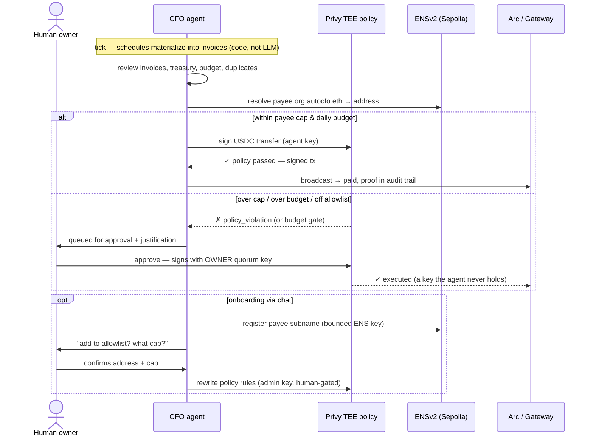

# AutoCFO 

**An autonomous CFO for any organization — with a mandate enforced by cryptography, not prompts.**
Built for ETHOnline 2026.

AutoCFO runs a company's money the way a real finance team would. The AI agent pays vendor
invoices in USDC when they're due, runs payroll on standing schedules, buys pay-per-call data
over x402, and pays contractors on whatever chain they prefer — but only inside a hard mandate:
a payee allowlist with **per-payee caps enforced by Privy's policy engine inside a TEE**, an
org-wide daily budget, and human sign-off (with a key the agent never holds) for anything
outside it. Every disbursement traces signal → decision → on-chain proof in an audit trail.

Any org can self-onboard in about a minute: AutoCFO provisions a policy-guarded treasury,
a petty-cash account, and an on-chain ENS identity — all custodied — and hands back one
access token.

## Why this is different

Most "AI agent + wallet" demos put the guardrails in the system prompt. AutoCFO's core claim
is that **autonomy is safe only when enforcement lives below the model**:

| Control | Enforced by | Bypass |
|---|---|---|
| Payee allowlist + per-payee payment cap | Privy policy engine, evaluated in a TEE at signing time | none — the agent's key is cryptographically incapable |
| Org per-transaction ceiling (bounds any cap grant) | service layer, deterministic | none |
| Org daily budget | service layer, checked before every send | human approval |
| Over-mandate payments | queued; execution requires the **owner quorum key** | that *is* the human |
| Payroll amounts & dates | code-materialized schedules — never generated by the LLM | — |
| Payee identity | ENSv2 records resolved live at pay time | — |
| Granting payment authority | tool refuses without explicit human confirmation of address **and** cap in chat | — |

## Architecture



## Payment decision flow



## Tech stack — what each piece actually does

**[Privy](https://privy.io) — the mandate.** Each org gets an organization wallet whose
*owner* is a human key quorum and whose *additional signer* is the agent, bounded by an
override policy. Every payment rule is an ABI-decoded calldata condition
(`transfer.recipient == payee && transfer.amount <= cap`) evaluated inside Privy's TEE at
signing time. Privy can't broadcast on Arc yet, so we use sign-only mode and broadcast with
viem — policies still apply at signing (findings in [PRIVY_FEEDBACK.md](./PRIVY_FEEDBACK.md)).

**[Arc](https://arc.io) (Circle's L1) — the settlement rail.** USDC is the native gas token
(one balance, ~sub-cent fees, sub-second finality) — the natural home for a treasury that
thinks in dollars. Chain config is a single swappable constant for the mainnet launch.

**[Circle Gateway + x402](https://developers.circle.com/gateway) — the petty-cash lane.**
A small dedicated EOA per org deposits USDC into Gateway and pays x402-priced APIs gaslessly
(EIP-3009 authorizations, batched settlement — $0.001 calls actually work). The same unified
balance mints on a contractor's preferred chain in under a second for cross-chain payouts.
The repo ships its own x402 seller so the demo is self-contained.

**[ENSv2](https://docs.ens.domains/ensv2/overview) (Sepolia beta) — the identity layer.**
`autocfo.eth` owns a UserRegistry; each org gets `org.autocfo.eth` with its **own
subregistry** (the hierarchy *is* the tenancy model), and payees live under it. Payout
addresses and preferred chains are resolver records **resolved live at pay time** through the
Universal Resolver. The agent holds a separate ENS key granted only `ROLE_REGISTRAR|ROLE_RENEW`
via Enhanced Access Control — it can onboard payees, it cannot touch parent names.

**Agent brain — Vercel AI SDK**, provider-swappable (`AI_PROVIDER=openai|anthropic`), with
a multi-turn chat that asks before it grants, per-step token caps, and 14 typed tools.

**App** — pnpm monorepo: Next.js 16 + Tailwind 4 dashboard, Hono API, Drizzle + SQLite,
viem everywhere.

```
apps/web        dashboard (ledger, approvals, chat, onboarding, company profile)
apps/agent      agent service + API + x402 seller + provisioning
packages/shared chain config, schema, USDC math
```

## Run it locally

```bash
pnpm install
cp .env.example .env                          # Privy app, AI key, chain config
pnpm --filter @autocfo/agent setup:privy      # one-time: org, wallet, policy, quorums
pnpm --filter @autocfo/agent spike:arc-send   # go/no-go: policy-checked send on Arc
# fund printed addresses at https://faucet.circle.com (Arc testnet USDC)
npx tsx apps/agent/scripts/ens-setup.ts       # register the ENS root (Sepolia ETH needed)
npx tsx apps/agent/scripts/ens-setup2.ts      # resolver + payee records + roles
pnpm --filter @autocfo/agent demo:reset       # seeded ledger (demo:clean = blank)
pnpm dev                                      # web :3000 · agent :3001 · seller :3002
```

See **[DEMO.md](./DEMO.md)** for the full demo runbook and a scripted 3-minute video flow.

## Deploy

- **Agent** — any Docker host: `apps/agent/Dockerfile`, volume at `/data`
  (`DATABASE_PATH=/data/autocfo.db`), env per the comment block in `fly.toml`,
  `ALLOW_ENV_ORG=false` so every request requires an org token. Fly/Railway/Render all work.
- **Dashboard** — Vercel, root `apps/web`, env `NEXT_PUBLIC_AGENT_API=https://<agent-host>`.

## Honest limitations

- Daily budgets are service-layer, not TEE — Privy's stateful policy aggregations have no
  SDK surface yet (v0.34); per-payee caps *are* TEE-enforced.
- Custodial by design for the hackathon: we hold org keys, ENS names, and the AI key.
  The provisioning path is one API call, so per-org key export or user-held owner keys are
  a straightforward next step.
- ENSv2 is Sepolia beta; contract addresses may move before mainnet.

## Prize tracks

**Privy** (B2B financial product · financial flows) · **Arc / Circle** (agentic economy:
Agent wallets-style custody, Gateway, x402 nanopayments, Arc settlement) · **ENS**
(ENSv2: hierarchical registries as multi-tenancy, Enhanced Access Control for a bounded
agent, live resolution — agents as namespaces with their own permissions).
